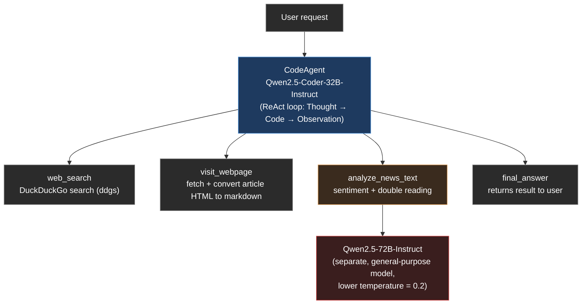

# News Analysis Agent — Sentiment & Derridean Double Reading

> ⚠️ **Experimental portfolio project.** This agent uses an LLM to *emulate the style* of a Derridean deconstructive reading. It is not a rigorous or reliable implementation of the method — see [Important caveat](#important-caveat-this-is-not-real-deconstruction) below before treating any output as genuine philosophical or literary analysis.

An AI agent built on [smolagents](https://github.com/huggingface/smolagents) that searches for news articles on a given topic, reads the full article content, and produces a two-part textual analysis: a sentiment classification and a Derridean-style "double reading" of the text.

Built as a portfolio project for the Hugging Face Agents Course, extending the course's `First_agent_template`.

## What it does

Given a natural-language request (e.g. *"Find recent news about Turkey's economy and give me a Derridean double reading of one article"*), the agent:

1. **Searches the web** for relevant news articles (DuckDuckGo search)
2. **Visits and reads** the full content of a selected article
3. **Analyzes the text** in three steps:
   - **Sentiment** — Positive / Negative / Neutral classification with justification
   - **Doubling commentary** — reconstructs the article's dominant framing on its own terms (what hierarchy or opposition it asserts, e.g. legitimate/illegitimate, order/chaos)
   - **Deconstructive reading** — attempts to identify a point where the text's own language undermines the opposition it relies on (a word or phrase describing the "solution" that could equally describe the "problem")

The agent reasons and acts using the **ReAct** pattern (Thought → Code → Observation) via `smolagents`' `CodeAgent`, which writes and executes Python code as its actions rather than emitting structured JSON.

## Important caveat: this is not "real" deconstruction

This project is explicitly **experimental**, and this section is not boilerplate — it reflects real, observed limitations during development.

- **Derrida's method of deconstruction is a rigorous, decades-deep philosophical practice.** It is not reducible to a three-step prompt template. What this tool does is prompt an LLM to imitate the *surface form* of one recognizable move in deconstructive reading (doubling commentary → locating a point of collapse between an opposition's two terms), using worked examples to steer the model away from simple paraphrase.
- **The LLM frequently fails at the actual philosophical move.** During testing, the model's most common failure was producing something that *sounds* deconstructive (using words like "hierarchy," "undermines," "collapses") while actually just restating that "both sides share a goal" — which is a harmony argument, not a deconstructive one. Getting genuinely valid output required multiple prompt iterations, a stronger general-purpose model, and lower temperature, and even then results are inconsistent between runs on the same text.
- **Language model output on hard interpretive/philosophical tasks should not be trusted at face value.** Treat every "deconstructive reading" this tool produces as a rough, possibly wrong, creative writing prompt — a starting point for your own thinking, never a citation-worthy analysis.
- If you are studying post-structuralism or IR theory seriously, use this tool to spark ideas, not to shortcut close reading of primary or secondary sources.

## Architecture



Two separate models are used deliberately:
- **Qwen2.5-Coder-32B-Instruct** drives the agent's own ReAct loop, since each action is Python code.
- **Qwen2.5-72B-Instruct** (temperature `0.2`) is called inside `analyze_news_text` for the actual interpretive analysis. A general-purpose instruct model consistently outperformed the code-specialized model on this interpretive task during testing — but as noted above, "outperformed" still means "occasionally produces a real deconstructive move," not "reliably does philosophy."

## Setup

**1. Clone and install dependencies**
```bash
git clone <your-repo-url>
cd First_agent_template
pip install -r requirements.txt
```

**2. Set your Hugging Face token**

Create a `.env` file in the project root (not committed to git):
```
HF_TOKEN=hf_your_token_here
```

**3. Run**
```bash
python app.py
```

Open the local Gradio URL printed in the console (typically `http://127.0.0.1:7860`).

## Example usage

```
Find recent news about Turkey's economy and give me a Derridean double reading of one article.
```

```
Найди последние новости об экономике Турции на русском языке и сделай анализ тональности и деконструктивное прочтение одной статьи.
```

The agent supports queries in English, Russian, and Turkish, though analysis quality (particularly the deconstructive step) is strongest in English given the underlying models' training distribution — and, per the caveat above, is inconsistent in all three languages.

## Known limitations

- Free-tier DuckDuckGo search can occasionally rate-limit or return no results for very generic queries
- The deconstructive reading step is an LLM-driven emulation of a literary/philosophical method — **not** a rigorous implementation. Expect inconsistent quality, including outright wrong or circular reasoning on some runs
- `max_steps=8` may not always be sufficient for longer research chains (search → read → analyze); increase if the agent frequently hits the step limit
- No automated evaluation of output quality exists yet — all quality assessment so far has been manual, single-example spot-checking during development

## Credits

Built on top of the [Hugging Face Agents Course](https://huggingface.co/learn/agents-course) `First_agent_template`, using [smolagents](https://github.com/huggingface/smolagents).